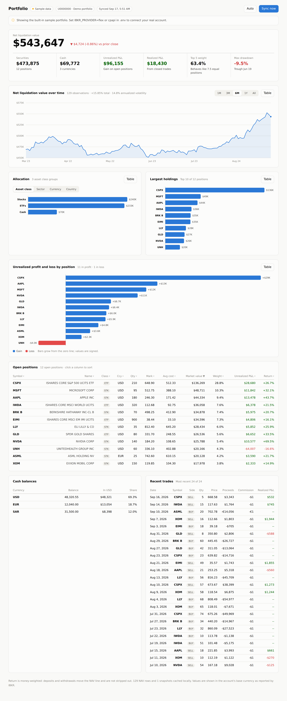

# IBKR Portfolio Dashboard

[](https://github.com/kelsokkary77/Dr.khaled-Elsokkary/actions/workflows/ibkr-dashboard.yml)

A local web dashboard that syncs an Interactive Brokers account and renders it
as tables and charts. It runs on your own machine, stores nothing in the cloud,
and never places orders — every IBKR call it makes is read-only.



---

## What you get

| Section | Shows |
|---|---|
| **Hero + tiles** | Net liquidation value, day change, cash, securities, unrealized and realized P&L, top-5 weight, max drawdown |
| **NAV chart** | Net liquidation over time, with crosshair, tooltip and 1M/3M/6M/1Y/All ranges |
| **Allocation** | Market value by asset class, sector, currency or country |
| **Largest holdings** | Top 10 positions by market value |
| **P&L by position** | Diverging bars — gains right, losses left, on one shared scale |
| **Open positions** | Sortable table: quantity, mark, average cost, market value, weight, P&L, return |
| **Cash balances** | Per-currency balance, base-currency equivalent, share of cash |
| **Recent trades** | Date, side, quantity, price, proceeds, commission, realized P&L |

Every chart has a **Table** toggle, so no number is reachable only through color.

---

## Running it

### 1. Check you have Python 3.11 or newer

```bash
python3 --version
```

macOS still ships Python 3.9, which is too old. If yours is below 3.11:

| | |
|---|---|
| macOS | `brew install python@3.13`, or download from [python.org](https://www.python.org/downloads/) |
| Ubuntu | `sudo apt install python3.13 python3.13-venv` |
| Windows | [python.org](https://www.python.org/downloads/) — tick **"Add python.exe to PATH"** |

`run.sh` checks this for you and says exactly what to install if the version is
too old, rather than failing later with a confusing error.

### 2. Get the code

```bash
git clone https://github.com/kelsokkary77/Dr.khaled-Elsokkary.git
cd Dr.khaled-Elsokkary/ibkr_dashboard
```

No git? Download the repository as a ZIP from GitHub (**Code → Download ZIP**),
unzip it, and open the `ibkr_dashboard` folder in a terminal.

### 3. Start it

```bash
./run.sh
```

Then open **<http://127.0.0.1:8787>**. Press **Ctrl+C** in the terminal to stop.

The first run takes about half a minute: it creates a virtualenv and installs
three dependencies. After that it starts in a couple of seconds.

**Windows**, which has no bash, run these three lines instead:

```bat
py -3.13 -m venv .venv
.venv\Scripts\pip install -r requirements.txt
.venv\Scripts\python -m uvicorn backend.main:app --host 127.0.0.1 --port 8787
```

### What you'll see first

The dashboard opens on the **built-in sample portfolio** — no IBKR credentials
needed, nothing connected. That is deliberate: you get to see exactly what it
does before handing it anything real. A banner at the top says so.

To connect your own account, pick one of the two options below.

### Using a different Python or port

```bash
PYTHON=/usr/local/bin/python3.13 ./run.sh   # a specific interpreter
IBKR_PORT=9000 ./run.sh                     # a different port
```

If a run fails partway through, delete the `.venv` folder and run `./run.sh`
again — it rebuilds from scratch.

---

## Choosing a data source

| | **Flex Web Service** | **Client Portal Web API** |
|---|---|---|
| Setup | A token and a query ID | Download and run IBKR's gateway |
| Software running | None | A Java process, logged in |
| Data freshness | Statement data, refreshed about daily | Live |
| NAV history | Comes with the query | Built up one sync at a time |
| Trades | Yes | Not read by this dashboard |
| Best for | A daily picture you can leave unattended | Watching the book move today |

**Most people want Flex.** It needs nothing running, it gives you real NAV
history from day one, and a token cannot place trades.

---

## Option A — Flex Web Service

### 1. Create the Flex query

In Client Portal: **Performance & Reports → Flex Queries → Activity Flex Query → +**

- Format: **XML**
- Period: **Last 365 Calendar Days** (this is what fills the NAV chart)
- Include these sections:

| Section | Feeds |
|---|---|
| Account Information | Account ID, alias, base currency |
| Open Positions | Positions table, allocation, P&L charts |
| Cash Report | Cash balances table, currency allocation |
| Net Asset Value (NAV) in Base | The NAV chart and drawdown |
| Trades | Recent trades table, realized P&L |

Save it and note the **Query ID** shown in the list.

### 2. Generate the token

**Settings → Flex Web Service → Generate token.** Copy it — tokens expire one
year after creation.

### 3. Configure

```bash
cp .env.example .env
```

```ini
IBKR_PROVIDER=flex
IBKR_FLEX_TOKEN=your_token_here
IBKR_FLEX_QUERY_IDS=1234567
```

Restart, then press **Sync now**. You can list several query IDs separated by
commas; overlapping rows are de-duplicated.

---

## Option B — Client Portal Web API (live)

1. Download the **Client Portal Gateway** from IBKR and unzip it.
2. Start it: `bin/run.sh root/conf.yaml` (Windows: `bin\run.bat root\conf.yaml`).
3. Open <https://localhost:5000> and log in. Accept the self-signed certificate
   warning — the gateway generates that certificate locally.
4. Configure:

```ini
IBKR_PROVIDER=cpapi
IBKR_CPAPI_ACCOUNT_ID=U1234567   # optional; blank uses the first account
```

The dashboard calls `/tickle` on every sync to keep the session alive. IBKR
still logs the gateway out periodically, so expect to log in again now and then;
when that happens the dashboard says so instead of showing stale numbers.

**On the certificate:** TLS verification is skipped only for `localhost`,
`127.0.0.1` and `[::1]`. If you point `IBKR_CPAPI_BASE_URL` at any other host,
the certificate is verified regardless of `IBKR_CPAPI_VERIFY_SSL`.

---

## How NAV history works

This matters for reading the chart correctly.

- **Flex** returns a dated NAV series, so the chart is populated on the first sync.
- **Client Portal** returns only *right now*. Each sync writes one dated row to
  local SQLite, so the series grows as you keep using the dashboard. One sync
  gives one point.

Either way, rows land in `data/ibkr.sqlite3` and are keyed on
`(account, date)` — syncing twice in a day overwrites that day rather than
adding a duplicate.

**The return figure is money-weighted.** Deposits and withdrawals move the NAV
line and are not stripped out, so a deposit reads as a gain. For a
time-weighted return, use IBKR's own PortfolioAnalyst report.

---

## API

The frontend is just a client of these. Everything returns JSON.

| Method | Path | Purpose |
|---|---|---|
| `GET` | `/api/health` | Provider, cache state, last sync result |
| `GET` | `/api/providers` | All three providers, readiness, setup steps |
| `POST` | `/api/sync` | Pull from IBKR. `?provider=` overrides for one call |
| `GET` | `/api/dashboard` | The full payload the UI renders |
| `GET` | `/api/positions` | Positions with portfolio weights |
| `GET` | `/api/nav` | NAV series plus return, volatility, drawdown |
| `GET` | `/api/allocation` | Asset class, sector, currency, country |
| `GET` | `/api/trades` | Trades and monthly activity. `?limit=` |

Interactive docs are at `/docs`.

```bash
curl -s localhost:8787/api/health | python3 -m json.tool
curl -s -X POST localhost:8787/api/sync
```

---

## Layout

```
ibkr_dashboard/
├── backend/
│   ├── config.py        Settings from .env, with working defaults
│   ├── models.py        Normalized Position / Cash / Trade / NavPoint
│   ├── providers/
│   │   ├── demo.py      Offline sample portfolio
│   │   ├── flex.py      Flex Web Service (XML, two-step polling)
│   │   └── cpapi.py     Client Portal Web API (local gateway)
│   ├── analytics.py     Allocation, concentration, drawdown, activity
│   ├── store.py         SQLite snapshot cache + NAV history
│   ├── service.py       Sync orchestration
│   └── main.py          FastAPI routes
├── frontend/            index.html, app.js, charts.js, styles.css
└── tests/
```

Providers all return the same `PortfolioSnapshot`, so analytics and the UI never
know which source they are looking at. Adding a source means writing one class.

The frontend has **no dependencies and loads nothing from a CDN** — the charts
are hand-built SVG. A dashboard that reads a brokerage account should not ship
third-party JavaScript, and it works with the network off.

---

## Tests

```bash
pip install -r requirements-dev.txt
python3 -m pytest tests/ -q
```

87 tests, none of which touch the network: Flex parsing runs against
representative statement XML, and the API tests run the demo provider through
FastAPI's `TestClient`.

### Continuous integration

`.github/workflows/ibkr-dashboard.yml` runs on every pull request that touches
this directory, and on pushes to `main`:

| Job | What it proves |
|---|---|
| **Tests** | The suite passes on Python 3.11, 3.12 and 3.13 |
| **Server smoke test** | The app boots, binds a port, syncs, and returns a payload with positive NAV and weights summing to 100% — none of which `TestClient` can show |
| **Frontend syntax** | Both ES modules parse, and nothing pulls in a remote script, stylesheet or font |

That last check is a guard, not a formality: this page reads a brokerage
account, so a CDN reference should fail the build rather than ship.

---

## Security notes

- `.env` is gitignored. Treat a Flex token like a password — it can read your
  full account history.
- The server binds to `127.0.0.1` by default. It has no authentication, so do
  not expose it on a network you share.
- Nothing leaves your machine except the calls to IBKR.
- Both providers are read-only. Neither the Flex token nor the endpoints this
  dashboard calls can place, modify or cancel an order.

---

## Troubleshooting

| Message | What to do |
|---|---|
| `Token has expired` (1012) | Generate a new Flex token; they last one year |
| `Statement generation in progress` | Normal for big queries — it polls automatically. Raise `IBKR_FLEX_POLL_ATTEMPTS` if it still times out |
| `returned no positions and no NAV rows` | The Flex query is missing sections — add the five listed above |
| `Gateway is not authenticated` | Open <https://localhost:5000> and log in again |
| `Another session is competing` | Log out of TWS / Client Portal elsewhere |
| HTTP 403 from Flex | Wrong token, or the query ID belongs to another user |
| NAV chart says "Not enough history" | Expected on `cpapi` after one sync — it needs at least two |
